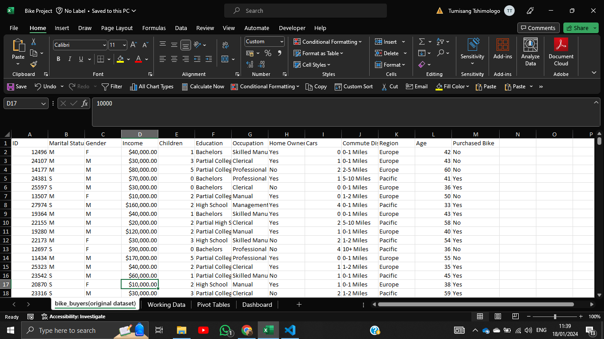
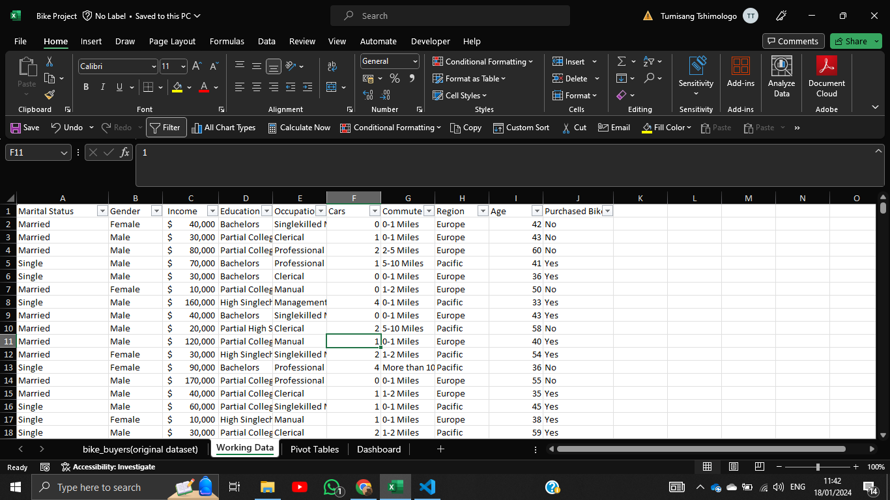
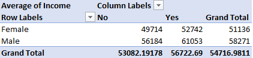
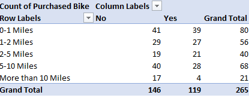
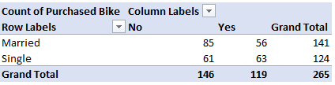

# TSHIMO'S BIKE EVALUATION REPORT
*Prepared By:  Tumisang Tshimologo* 

*Date: 18/01/2024*

## PROJECT OVERVIEW
### Title
- Purchased Bike Evaluation Project

### Objectives
#### 1. Customer loyalty analysis
- Which gender purchased the most bikes?
- Where is the highest customer based situated?
#### 2. Geographical analysis
- How many bikes are purchased per commute distance?
#### 3. Marketing analysis
- Which forms of advertising should Tshimo's Biking Hub invest in?

## BACKGROUND 
### Problem Study 
Tshimo's Biking Hub aspires to increase their sales ultimately increasing their turnover; however they are unaware of which advertising measures to implement as they have not identified who their customers are and where the said customers are located. Your task as a data analyst is to employ the data they provided and assist them in choosing advertising methods tailored for their customer base.

### Context
Tshimo's Biking Hub, a dynamic and exhilarating cycling haven, was established in 1990 by avid cyclist and entrepreneur, Theo Mitchell. Fueled by Theo's passion for all things biking, the store offers a thrilling shopping experience with an extensive range of products that seamlessly caters to cycling enthusiasts of all levels. The walls adorned with action-packed biking imagery and tables featuring creatively displayed bike accessories contribute to the store's energetic ambiance.

Tshimo's takes pride in curating a selection of top-notch biking gear, emphasizing the thrill and adventure of cycling. The store is dedicated to sourcing high-quality equipment, from cutting-edge bicycles to state-of-the-art accessories, ensuring that cyclists enjoy a smooth and exciting ride every time. Tshimo's commitment extends to promoting eco-friendly commuting solutions and supporting the local biking community.

Over the years, Tshimo's Biking Hub has become a go-to destination for biking aficionados, recognized for its friendly and knowledgeable staff, an extensive inventory that caters to various biking styles, and an unwavering commitment to providing an unparalleled shopping experience. Theo Mitchell's relentless pursuit of excellence in the biking industry has garnered the store widespread acclaim, solidifying its position as a premier hub for all things biking.

## DATA PREPROCESSING
### Data Collection
The dataset was acquired from the Google Coursera Data Analytics study materials.
### Data Description
The provided dataset consisted of 1027 entries and comprises 13 columns. The column names and the types of data contained in each column are as follows:

- ID: Natural numbers
- Marital Status: Letters
- Gender: Letters
- Income ($): Decimal numbers
- Children: Natural numbers
- Education: Letters
- Occupation: Letters
- Home Owner: Letters
- Cars: Natural numbers
- Commute Distance: Natural numbers
- Region: Letters
- Age: Natural numbers
- Purchased Bikes: Letters

### Data Cleaning

*fig 1. before data cleaning*

*fig 2. after data cleaning*

As shown in the above screenshot of the data provided trimming was executed to remove unnecessary spaces between words. Text in marital status and gender columns was written in full instead of the use of single characters. Data consistency was further implemented in the income column. Text cases were changed to proper to ensure uniformity. Additional data cleaning methods employed included removal on null/ missing columns, duplicates and unnecessary columns. Upon completion of data cleaning the dataset consisted of 1001 entries and 8 columns.

## EXPLORATORY DATA ANALYSIS (EDA)
### Key Statistics & Visualization
#### 1. Average Income Per Purchase Status Categorized By Gender

As illustrated by the above diagram Tshimo's Biking Hub recognizes two gender; male and female and it has two purchase status; no and yes. The average income of females who have not purchased bikes at Tshimo's Biking Hub is 49714 while that of those who have purchased bikes is 52742. Whereas the average income for males who have not purcahsed bikes is 56184 and that of males who have purchased bikes is 61053. Below the statistical analysis is a bar graph to visualize the results found. 

#### 2. Count Of Purchase Status Per Commute Distance

A statistical count of purchase status per commute distance is shown in the above diagram. Over a distance of 1 mile from Tshimo's Biking Hub 39 bikes were purchased however the numbers slightly decline as 27 bikes were purchased over a distance of 1-2 miles. For the distances of 2-5 miles the numbers of bikes purchased further drop to 21. The count slightly increases by 8 bikes purchased however for the distance of 5-10 miles. Additionally the number of bikes purchased for the distance on more than 10 miles is the lowest as only 4 bikes were purchased from Tshimo's Biking Hub. Following the statistical results is a line graph to showcast the results obtained above.

#### 3. Count Of Purchase Status Per Marital Status

As shown above more single people buy bikes compared to married people. The count of married people who have purchased bikes at Tshimo's Biking Hub is 56 whereas that of single people is 63. Below it is horizontal bar graph to visualize the above spoken of results.

## RESULTS AND FINDINGS
#### Main Insight
Tshimo's Biking Hub has more male and single customers. Most of their customers stay nearby.
#### Actionable Insight
- Creating adverts that apeal to sinlge men's interests, desires, and lifestyle.
   - Highlighting independence and freedom.
   - Showcasting adventure and exploration.
   - Using humor and lightheartedness.
- Creating adverts that tailor to married people's desire to spice things up and have a little adventure while having families.
- Using media the customer base is highly to use.
   - For single people:
      - Social media 
      - Content marketing 
   - For women:
      - Magazines
      - Billboards
   - For both marital status:
      - Podcasts
      - Radio
      - Television

## DATA ANALYSIS TECHINQUES
#### Methods
- Data Collection
- Data Description
- Support Decision Making

#### Data Cleaning
- Drop null entries
- Drop duplicates
- Drop unused columns
- Convert text to lowercase
- Space trimming
- Data consistency

#### Statistical Methods
1. Descriptive Statistics:
- Average
- Count

#### Data Visualization
- Bar Graph
- Line Graph
- Horizontal Bar Graph

## SKILLS DEMONSTRATED
- Statistical Knowledge
- Using Microsoft Excel 
- Data Cleaning and Preprocessing
- Data Visualization
- Critical Thinking
- Communication Skills
- Domain Knowledge
- Tools and Software:
    - Proficiency in using Excel.
    - Knowledge of Github version control system. 